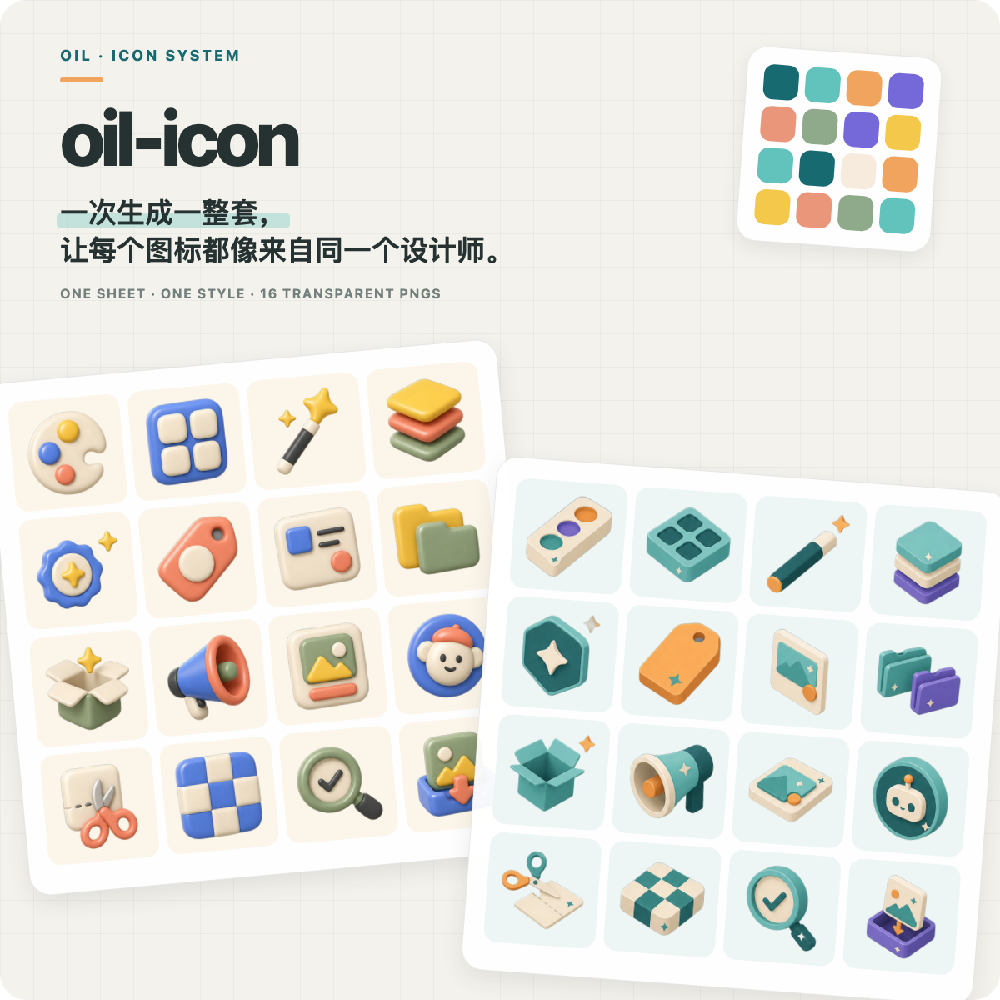
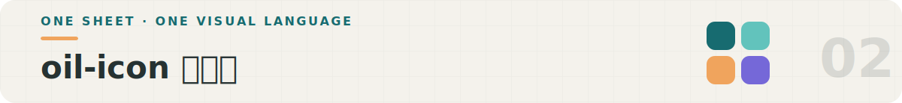
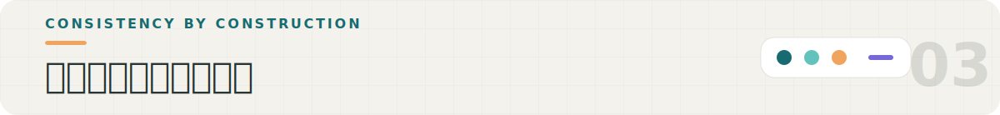
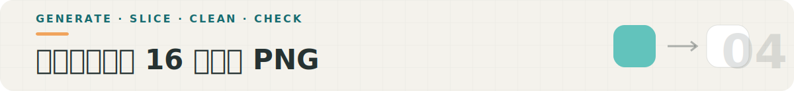
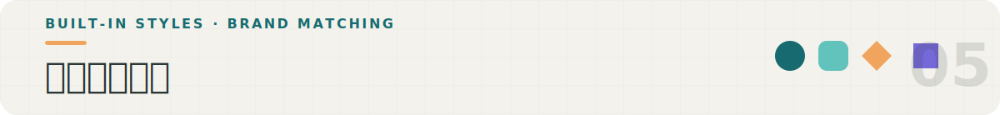
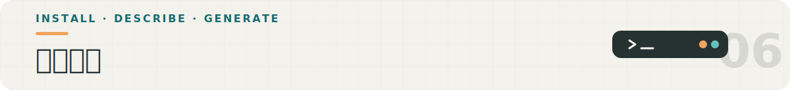

<p align="center">
  
</p>

<p align="center">
  
</p>

`oil-icon` 是一个给 Agent 使用的图标生成 Skill。我们只需要说明想要哪些图标、喜欢什么风格，或把项目的配色和页面交给它，它会生成一整套风格统一、背景透明、可以直接使用的 PNG 图标。

上面的两组图标使用了完全相同的 16 个概念：配色、网格、魔法棒、图层、品牌、标签、卡片、分类、空状态、营销、产品、角色、切图、透明背景、质检和导出。改变的是整套的画法，因此一组是柔软 3D，另一组是等轴微缩。

它适合产品功能、分类、营销卡片、空状态和品牌化插图；如果只是制作 16–24px 的按钮小图标，直接使用 Lucide 等矢量图标库会更合适。

<p align="center">
  
</p>

让模型一张一张画，后面的图标很容易忘记前面的线宽、圆角、视角和颜色。`oil-icon` 把 16 个图标放在同一次生成里，让模型始终看见整套作品；开始画之前，还会先把共同的规则定清楚。

一套图标会共同遵守：

- **同一套画法**：网格、视角、线宽、圆角和繁简程度一致。
- **同一套颜色**：色值直接锁定，避免每一批越画越艳、越画越偏。
- **同一个记号**：反复出现的小火花、切角或其他母题，让图标拥有自己的身份。
- **同一次生成**：16 个图标共享同一段视觉上下文，比逐张生成更容易保持一致。

所以它不是给通用图标换一套颜色，而是先把整套的画法定清楚，再让模型按照这些规则画完。

<p align="center">
  
</p>

```text
图标清单 + 风格或项目素材
          ↓
定好颜色、视角、圆角和专属记号
          ↓
在纯灰背景生成一张 4×4 图标图
          ↓
自动切成 16 张图片并移除背景
          ↓
在高对比底色检查灰边、串格和一致性
          ↓
交付 16 张透明 PNG
```

硬边图标使用颜色识别清除背景，3D、贴纸等软边图标使用背景移除模型。切图程序只保留每个格子中心的主体，避免把旁边图标的碎片一起带走。

<p align="center">
  
</p>

仓库里现在有 9 种内置预设，每一种都有自己的色彩、构造规则和背景移除方式：

| 预设 | 视觉特点 | 更适合 |
| --- | --- | --- |
| `linear` · 线性 | 单色描边、统一线宽、圆角收笔 | 工具、设置和内容密集的界面 |
| `filled` · 面性单色 | 清楚的实心轮廓，只使用一种主色 | 导航、标签栏和小面积强调 |
| `colorblock` · 撞色 | 2～3 种颜色组成简洁的几何色块 | 创意、教育和轻松活泼的产品 |
| `cartoon` · 卡通 | 粗描边、圆润造型和贴纸感 | 游戏、娱乐和角色化内容 |
| `isometric` · 等轴微缩 | 统一视角的立体小物件，结构清楚 | 工作台、功能介绍和 SaaS 产品 |
| `render3d` · 3D 渲染 | 柔软膨胀的形状、糖果色和细腻材质 | 引导、奖励、会员和营销卡片 |
| `sticker` · 贴纸 | 清楚的外轮廓、亮面材质和独立贴纸造型 | 社区、聊天、表情和活动素材 |
| `realistic` · 真实实物 | 接近产品摄影的真实物体 | 电商、商品分类和首屏展示 |
| `animal-badge` · 动物徽标 | 动物角色与统一徽章结构结合 | 头像、儿童产品和角色系统 |

这 9 种只是随仓库提供的稳定起点，不是 `oil-icon` 能做的全部风格。我们还可以：

- **直接修改预设**：替换配色，调整线宽、圆角、视角、材质和细节多少。
- **匹配现有品牌**：读取网站、Logo、截图和设计变量，把真实的颜色与形状规则整理成一套图标风格。
- **从文字描述开始**：没有现成设计也没关系，可以先用一句话确定方向，再生成第一张风格样板。
- **保存专属规则**：风格确认后，把色板、构造方式和专属记号固定下来，之后继续生成的新图标也会沿用同一套规则。

内置预设解决的是快速开始，品牌适配解决的是让图标真正属于这个产品。

<p align="center">
  
</p>

**方式一 · 执行命令**

```bash
npx skills add oil-oil/oil-icon
```

**方式二 · 直接交给 Agent**

把下面这句话发给任何支持 Skill 的 Agent：

```text
请安装这个 Skill：https://github.com/oil-oil/oil-icon
```

安装完成后，可以直接描述图标清单和使用场景：

```text
[$oil-icon] 根据这个产品的页面和配色，生成一套 16 个功能图标。
```

如果没有现成品牌，也可以指定一个方向：

```text
[$oil-icon] 为我的 AI 写作工具生成一套柔软 3D 图标，包含创作、改写、翻译、素材、历史和导出。
```

`oil-icon` 会优先使用 Agent 当前可用的图片生成能力；没有内置图片工具时，再根据环境选择其他生成方式。切图与检查流程保持一致。

<details>
<summary><strong>仓库里有什么</strong></summary>

- `SKILL.md`：完整工作流与执行规则
- `styles/`：内置风格和构造规范
- `reference/`：提示词、品牌适配、图标设计与生成说明
- `scripts/`：环境安装、切图和背景移除工具

</details>

## License

MIT
